# HGR-STAR

## 介绍

这是我的深度学习科研项目，HGR-STAR (Raw HD-sEMG Gesture Recognition via StarNet with HD-sEMG Embedding and Label Smoothing) 是借鉴并调整了 StarNet，以适应对 HD-sEMG 信号进行 65 类手势识别的任务。

> StarNet 是微软团队发表在 CVPR 2024 的超强轻量级骨干网络，其论文可从以下地址下载阅读：
> 
> [Rewrite the stars](https://arxiv.org/abs/2403.19967)

本项目使用 C++ 在 Windows 11 平台开发，使用了一个开源的 json 库 [nlohmann/json](https://github.com/nlohmann/json) 以方便配置模型与训练参数，`CMakeLists.txt` 中已经设置了自动下载该三方库依赖，无需手动下载，但如果有再修改本项目的需求，我建议克隆该 json 项目到本地，以便 IDE 能够检索代码。

同时，本项目使用了 PyTorch 的 C++ API [LibTorch](https://pytorch.org/) 来创建模型并编写训练验证代码。其中，[LibTorch](https://pytorch.org/) 的版本为 2.5.1 Release 版本，CUDA 版本为 1.2.4。虽然两者的安装较为繁琐，但网络上有较多教程可供参考，本文不在此赘述，请根据实际需求选择 LibTorch 与 CUDA 的版本。

## 项目结构

### 文件说明

- `.vscode` 文件夹包含本项目使用 Visual Studio Code 开发时，对编辑器的一些配置内容。
- `include` 文件夹包含所有类的声明文件。
- `json` 文件夹包含所有训练任务的 json 文件，通过 `run.bat` 进行自动化的多任务队列训练。
- `src` 文件夹则是这些声明的具体实现，出于快速开发的考虑，并未使用到复杂的模板编程、继承多态等，所以会有大量的重复代码，请见谅。
- `Stanby` 文件夹包含了所有本项目使用过的 json 文件。
- `.gitignore` 文件是本项目使用 git 管理时的文件，记录了忽略那些文件及文件夹的提交推送。
- `CMakeLists.txt` 文件是编译配置文件。
- `LICENSE` 文件则是 MIT 开源许可证。
- `README.en.md` 文件是本文的英文版本。
- `README.md` 文件是本文。
- `run.bat` 文件是进行自动化多任务队列训练的批处理文件。

### 类说明

- `DropPath`：由于 LibTorch 未提供路径丢弃层，故该类是对路径丢弃的实现。
- `Logger`：一个简单的日志类，可以提供基本的文件输出。
- `MultiFeatureDataset`：提供读取数据集功能的类，需要说明的是，**本项目在其他尝试中用到了不同特征，受限于时间，并未删除其中不属于本项目的内容**。
- `StarBlock`：最基本的星运算模块。
- `StarNet2503081200`：使用 **基于 ConvTranspose 的 HD-sEMG Embedding 模块**作为输入嵌入的 StarNet。
- `StarNet2503081200TV`：配套前者的训练验证类，`T` 表示训练，`V` 表示验证。
- `StarNet2503081200TVA`：前者的增强版本，引入了标签平滑技术，`A` 表示增强。
- `StarNet2503132330`：使用 **基于 Upsample+Conv+Conv 的 HD-sEMG Embedding 模块**作为输入嵌入的 StarNet。
- `StarNet2503132330TVA`：配套前者的训练验证类，同样在标签平滑技术的加持下进行训练。
- `StarNet2503141330`：使用 **基于 Upsample+Conv 的 HD-sEMG Embedding 模块**作为输入嵌入的 StarNet。
- `StarNet2503141330TVA`：配套前者的训练验证类，同样在标签平滑技术的加持下进行训练。
- `StarNet2510152000`：使用 **基于 STFT+Conv 的 HD-sEMG Embedding 模块**作为输入嵌入的 StarNet。
- `StarNet2510152000TV`：配套前者的训练验证类，`T` 表示训练，`V` 表示验证。
- `StarNet2510152000TVA`：配套前者的训练验证类，在标签平滑技术的加持下进行训练。
- `StarNet2510161140`：微调了前者，即 **基于 STFT 的 HD-sEMG Embedding 模块**作为输入嵌入的 StarNet。
- `StarNet2510161140TVA`：配套前者的训练验证类，在标签平滑技术的加持下进行训练。
- `SummarizeResult`：汇总结果的类。

## 部署指南

### 硬件配置

本项目最后一次运行在以下硬件配置的个人电脑上：

- **CPU:** 13th Gen Intel(R) Core(TM) i7-13700KF (3.40 GHz)
- **GPU:** ROG STRIX RTX4080S O16G GAMING
- **RAM:** Asgard DDR5 32 GB(16 GB x 2) 6800 MHz CL38
- **Motherboard:** ROG STRIX B760-G GAMING WIFI
- **Storage:**
  - **SSD:** ZHITAI TiPlus7100 SSD 512 GB
  - **SSD:** ZHITAI TiPlus7100 SSD 2048 GB
- **Power Supply Unit (PSU):** Seasonic Focus GX-850

### 软件配置

本项目最后一次运行在以下软件配置：

- **System:**
  - **Edition:** Windows 11 Home
  - **Version:** 25H2
  - **Installed on:** 2025/1/25
  - **OS build:** 26200.7623
- **GPU Driver:** 581.57
- **NVIDIA (R) Cuda Compiler Driver (NVCC):** release 12.4, V12.4.99
- **LibTorch:** 2.5.1+cu124
- **C/C++ Compiler:** Microsoft (R) C/C++ Optimizing Compiler Version 19.44.35222 for x64
- **CMake:** 3.30.1
- **MATLAB:** R2018b
- **Git:** 2.51.0.windows.2
- **Python:** 3.7.3

### 软件的安装

我们不确定软件的安装配置顺序是否会产生不利影响，但我们建议按照以下顺序准备环境。

#### C/C++ Compiler

若你使用 Windows 操作系统，我们强烈建议下载安装 [Microsoft Visual Studio](https://visualstudio.microsoft.com/zh-hans/) 以获取最适合 Windows 系统的 C/C++ 编译器。

> ⚠️**注意:** 截止本地时间 2026年1月18日02:58:01，CUDA Toolkit 12.4 与 CUDA Toolkit 13.1 (最新版本 CUDA) 中的**Visual Studio Integration**均不支持微软主推的 Visual Studio 2026，所以我们需要安装 Visual Studio 2022。

> 🕰**本地时间:** 2026年1月18日03:01:50

1. 在 [Microsoft Visual Studio](https://visualstudio.microsoft.com/zh-hans/) 中下载**VisualStudioSetup.exe**。
2. 双击下载好的**VisualStudioSetup.exe**，自动完成**Visual Studio Installer**的安装。
3. 直接关闭启动的**Visual Studio Installer**。
4. 在**命令提示符**中输入`winget show --versions "Microsoft.VisualStudio.2022.Community"`，以查看所有可用的**Visual Studio 2022 Community** 版本。

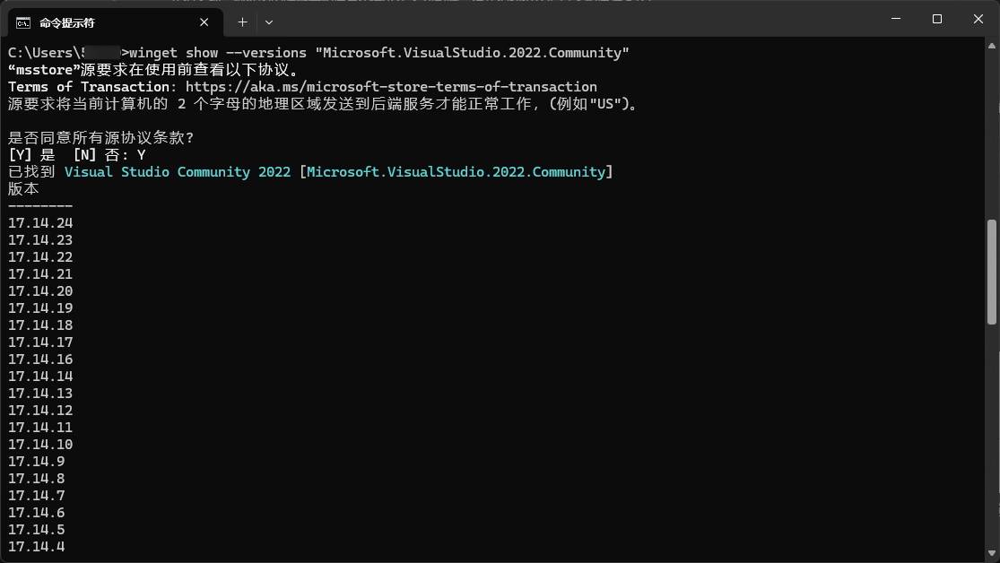

5. 在**命令提示符**中输入`winget install -v 17.14.24 "Microsoft.VisualStudio.2022.Community""`，**Visual Studio Installer**会自动启动并下载安装**Visual Studio 2022 Community**。
6. 重新打开**Visual Studio Installer**，可以看到出现所需的**Visual Studio 2022 Community**。

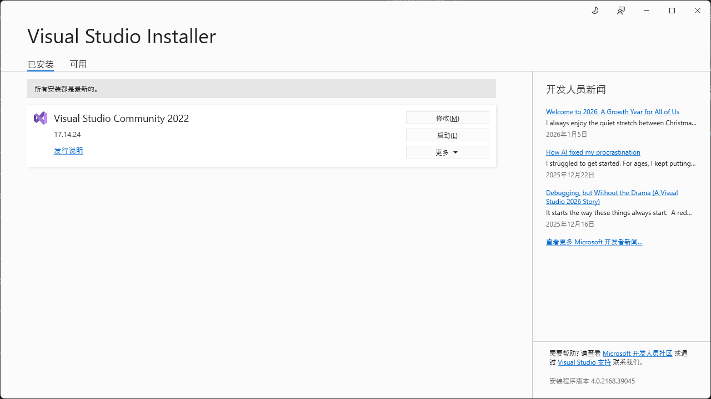

7. 点击**修改**，在**工作负荷**中确保勾选`使用 C++ 的桌面开发`，随后下载安装。

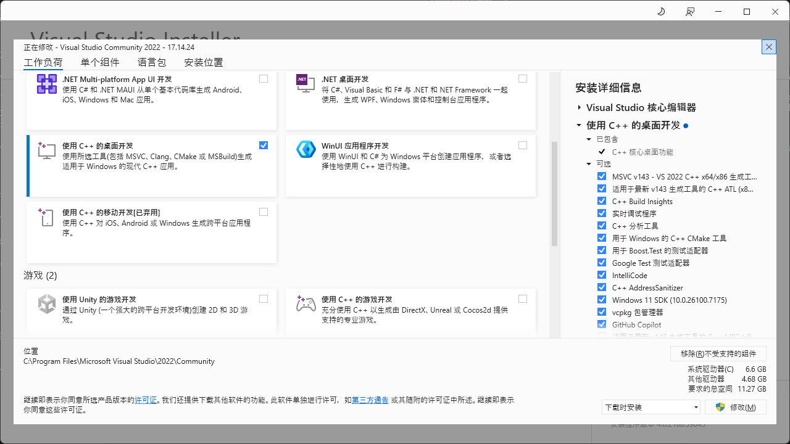

8. 重启计算机。
9. 添加到环境变量。

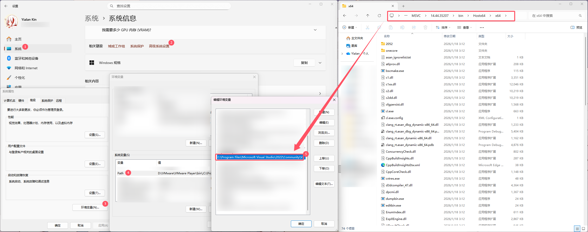

10. 在**命令提示符**中输入命令 `cl` 以确认能识别到 cl 编译器。

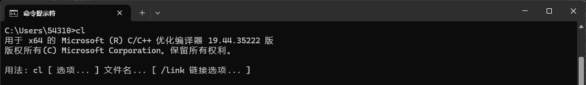

#### GPU Driver

GPU 驱动版本通常对 CUDA 的支持版本向下兼容，所以请务必使用 [NVIDIA App](https://www.nvidia.cn/software/nvidia-app/) 或其他方式更新 GPU 驱动，以保证至少支持 [CUDA 12.4](https://developer.nvidia.com/cuda-12-4-0-download-archive) 的安装与使用。

本文环境已经安装了 [NVIDIA App](https://www.nvidia.cn/software/nvidia-app/)，下面给出更新 GPU 驱动的实践步骤：

> 🕰**本地时间:** 2026年1月17日18:13:07

1. 打开 NVIDIA App。

2. 在**驱动程序**界面中**下载**最新的驱动程序 (本文使用 GeForce Game Ready 驱动程序)。

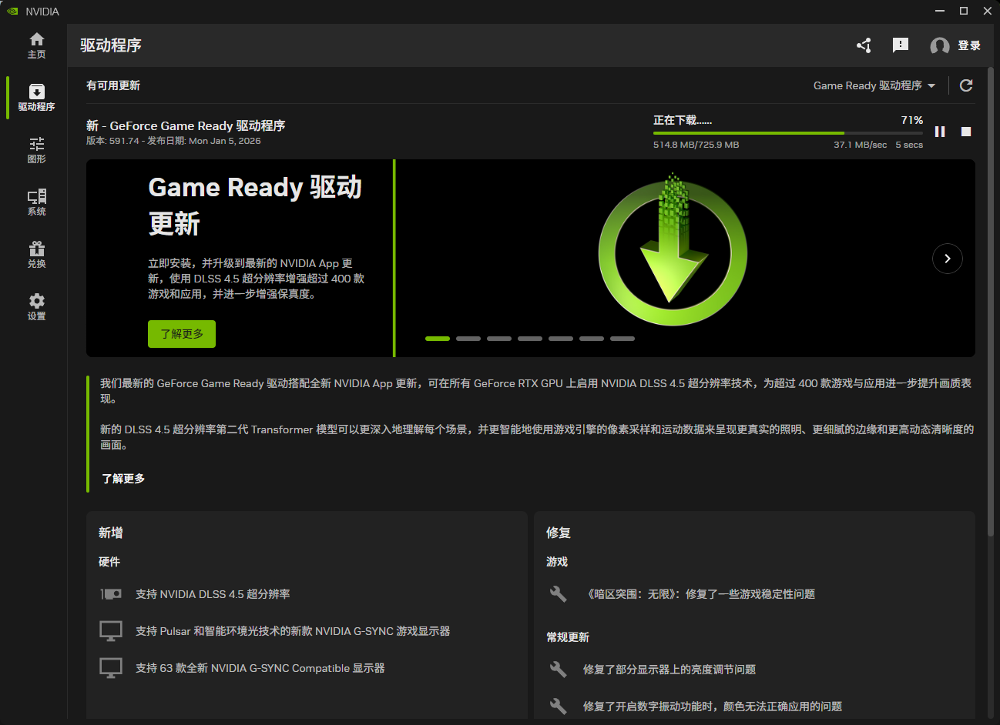

3. 在**驱动程序**界面中**安装**下载好的驱动程序 (本文选择**快速安装**)。

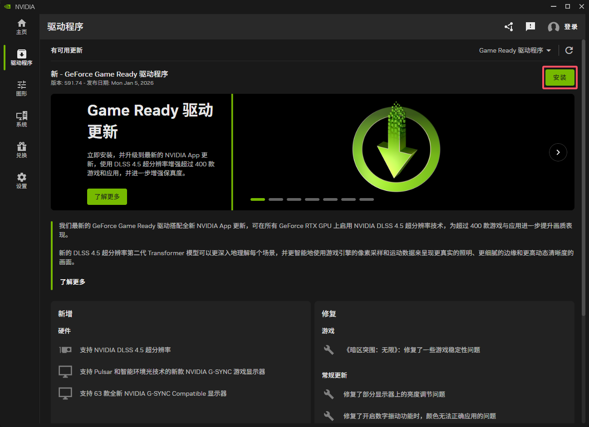

4. 按照建议重启计算机。

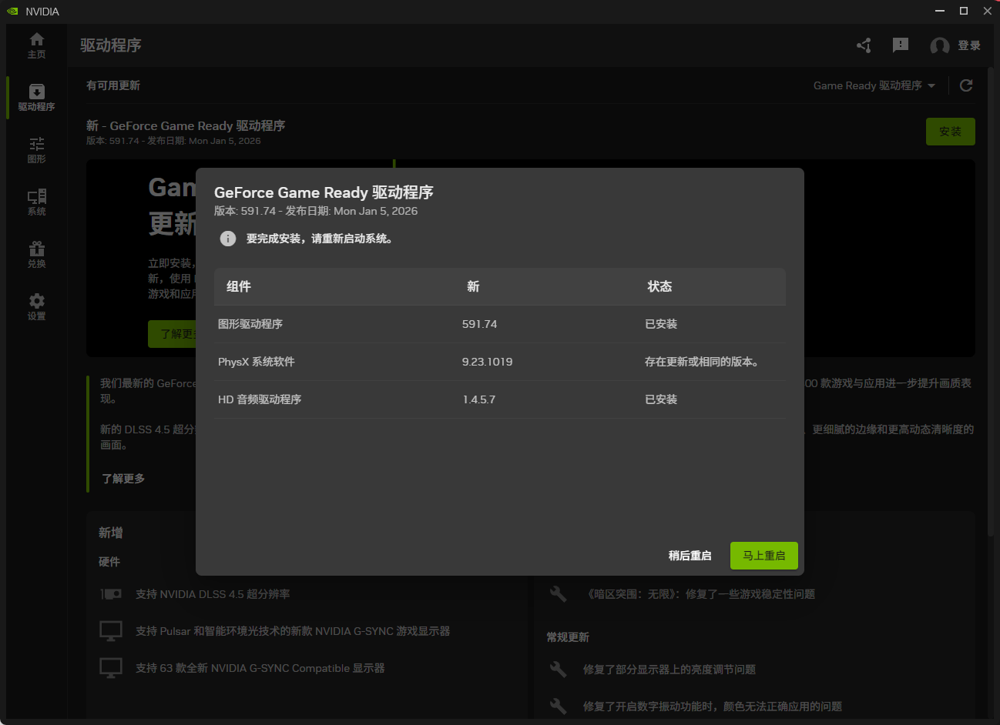

5. 在**命令提示符**中输入命令 `nvidia-smi` 以确认驱动版本与最高支持的 CUDA 版本。其中 `Driver Version: 591.74` 表示当前驱动版本为 `591.74`，`CUDA Version: 13.1` 则表示最高支持的 CUDA 版本为 `13.1`。

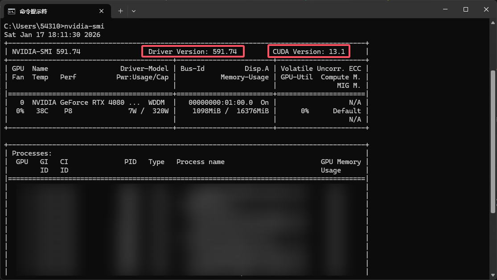

#### CUDA Toolkit

本项目在开发时使用了 [CUDA Toolkit 12.4](https://developer.nvidia.com/cuda-12-4-0-download-archive?target_os=Windows&target_arch=x86_64&target_version=11&target_type=exe_local)，不保证在其他版本下可以通过编译并运行，所以我们建议下载并安装相同的版本。

> ⚠️**注意:** 由于本文环境已经安装了 CUDA Toolkit 12.4，且 CUDA 的卸载较为繁琐，故本文仅提供关键的安装步骤。

> 🕰**本地时间:** 2026年1月17日19:34:47

1. 在 [CUDA Toolkit 12.4 下载页面](https://developer.nvidia.com/cuda-12-4-0-download-archive?target_os=Windows&target_arch=x86_64&target_version=11&target_type=exe_local) 勾选符合环境的选项并下载。

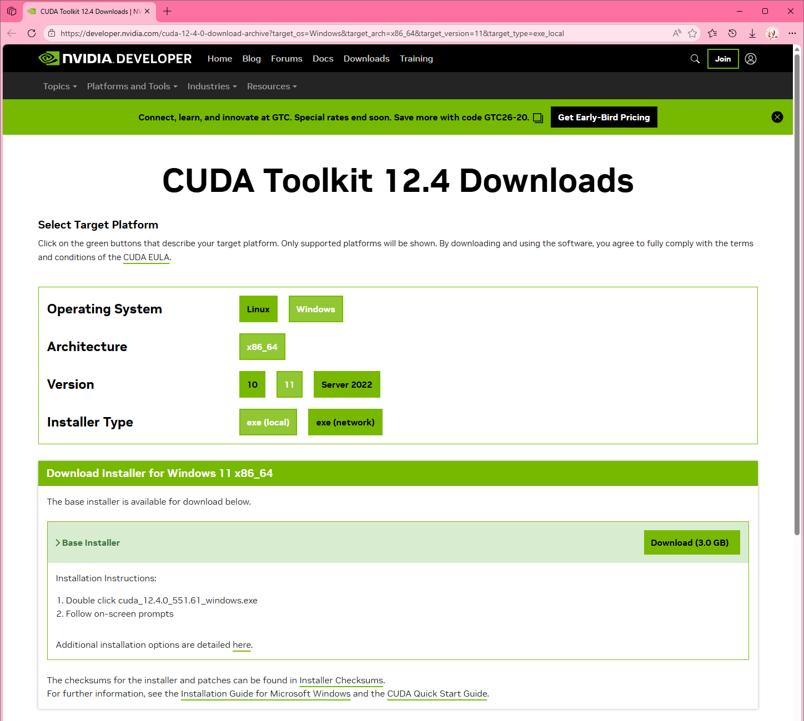

2. 打开下载好的 `cuda_12.4.0_551.61_windows.exe` 进行安装 (图中的路径是安装过程中产生的临时文件的路径)。

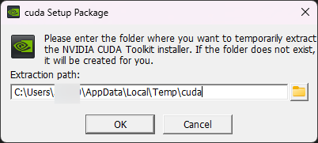

3. 通过**精简**模式安装 (具体安装过程本文不便展示)。

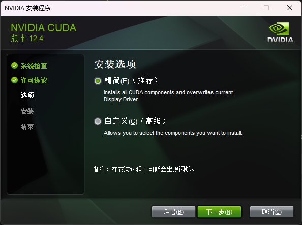

> ⚠️**注意:** [CUDA Toolkit 12.4](https://developer.nvidia.com/cuda-12-4-0-download-archive?target_os=Windows&target_arch=x86_64&target_version=11&target_type=exe_local) 的安装包中并未提供 NVIDIA Tools Extension Library (NVTX)，若缺少该工具会导致编译报错。接下来我们将安装该工具。

4. 在 [CUDA Toolkit 11.8 下载页面](https://developer.nvidia.com/cuda-11-8-0-download-archive?target_os=Windows&target_arch=x86_64&target_version=11&target_type=exe_local) 勾选符合环境的选项并下载。

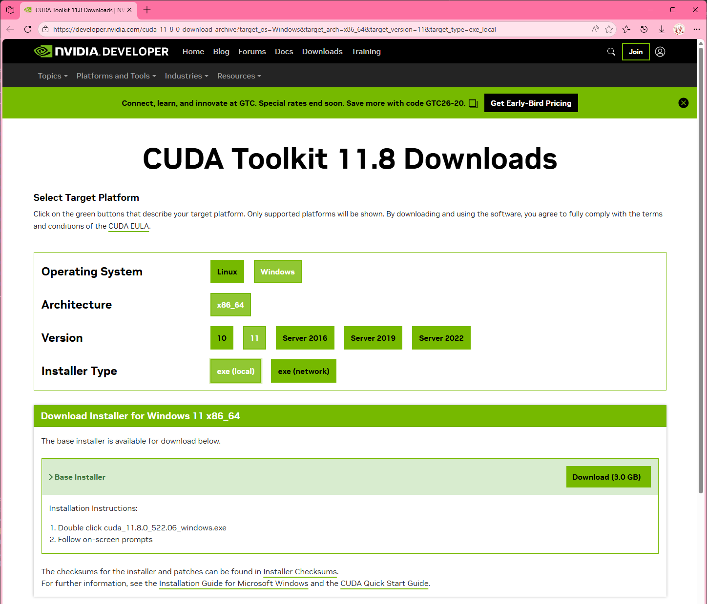

5. 打开下载好的 `cuda_11.8.0_522.06_windows.exe` 进行安装 (图与步骤 2 相同)。  

6. 通过**自定义**模式安装，仅需勾选 `Nsight NVTX` (具体安装过程本文不便展示)。

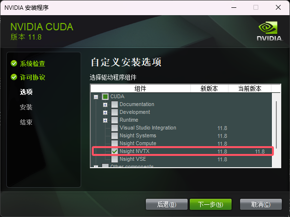

7. 确保系统环境变量中包含:
- `CUDA_PATH=C:\Program Files\NVIDIA GPU Computing Toolkit\CUDA\v12.4`
- `CUDA_PATH_V12_4=C:\Program Files\NVIDIA GPU Computing Toolkit\CUDA\v12.4`
- `NVTOOLSEXT_PATH=C:\Program Files\NVIDIA Corporation\NvToolsExt\`
- `PATH`:
  - `C:\Program Files\NVIDIA GPU Computing Toolkit\CUDA\v12.4\bin`
  - `C:\Program Files\NVIDIA GPU Computing Toolkit\CUDA\v12.4\libnvvp`

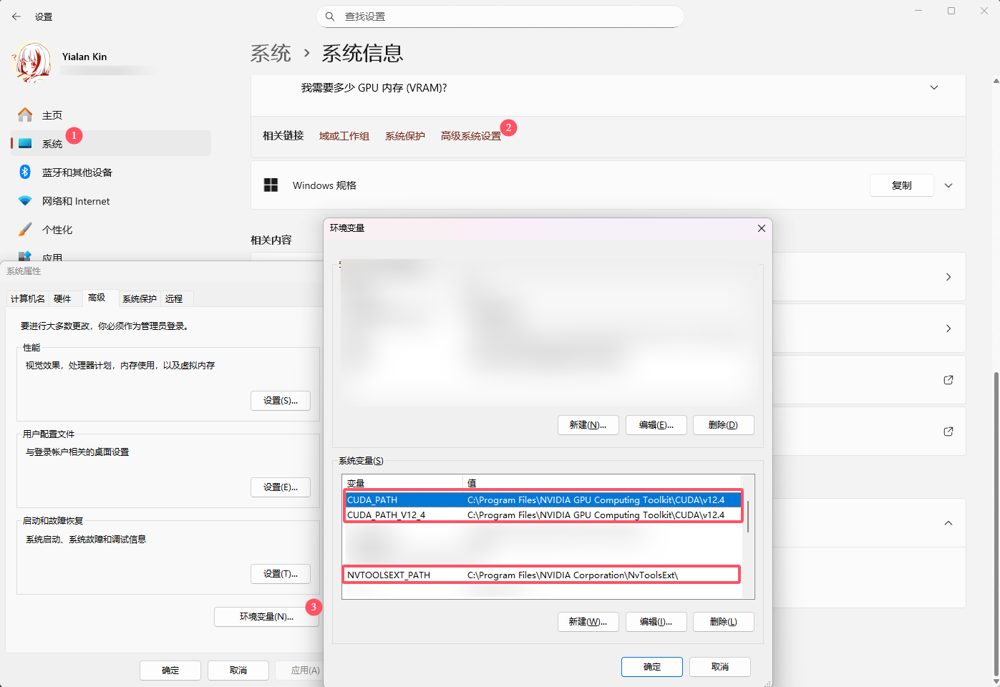

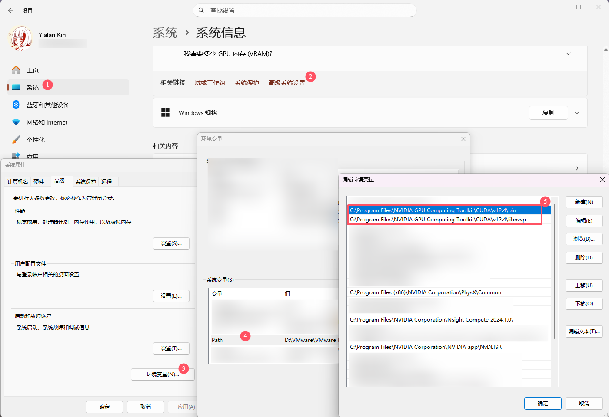

8. 在**命令提示符**中输入命令 `nvcc --versoin` 以确认能识别到安装好的 CUDA。

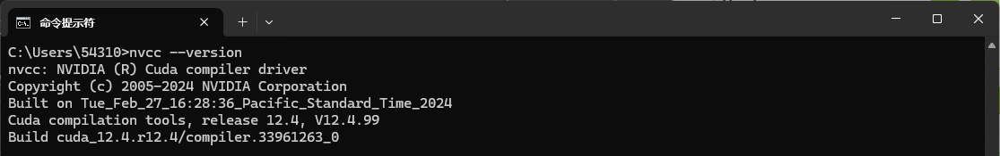

#### LibTorch

Torch 的版本选择基本与 CUDA Toolkit 的版本所绑定，在相同 CUDA 版本内，不同的 Torch 版本之间大概率是相互兼容的 (本文使用过 LibTorch 2.4.0+cu124 的 Debug 版本，以及 LibTorch 2.5.1+cu124 的 Release 版本)，但本文仍然建议使用 LibTorch 2.5.1+cu124 来保证编译通过。

LibTorch 的安装非常简单，只需下载并解压即可，但 PyTorch 似乎没有提供 LibTorch 的历史版本页面，不过我们可以通过下载链接的前缀来访问历史版本的存档页面。

下面提供具体的下载解压实践步骤。

> 🕰**本地时间:** 2026年1月17日20:42:46

1. 打开 [页面](https://download.pytorch.org/libtorch/cu124/)，可以看到 LibTorch 对 CUDA Toolkit 12.4 的历史支持版本下载链接：其中 `libtorch-shared-with-deps-2.x.x%2Bcu124.zip` 是用于 Linux 系统下的版本；`libtorch-win-shared-with-deps-2.x.x%2Bcu124.zip` 是用于 Windows 系统下的 Release 版本；`libtorch-win-shared-with-deps-debug-2.x.x%2Bcu124.zip` 是用于 Windows 系统下的 Debug 版本。本文建议使用 Release 版本，以使编译器可以选择优化选项，使编译后程序的运行速度远高于 Debug 版本。

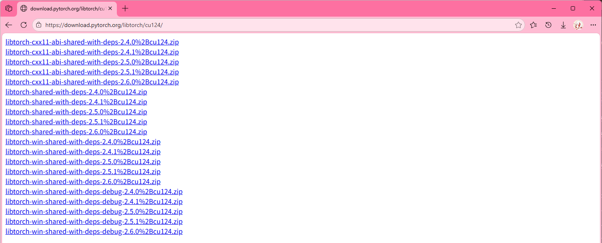

2. 下载本文使用的 [LibTorch 2.5.1+cu124 Release](https://download.pytorch.org/libtorch/cu124/libtorch-win-shared-with-deps-2.5.1%2Bcu124.zip)。

3. 将其解压到空间足够的硬盘，便于区分多个版本的 LibTorch，可以重命名解压得到的文件夹。

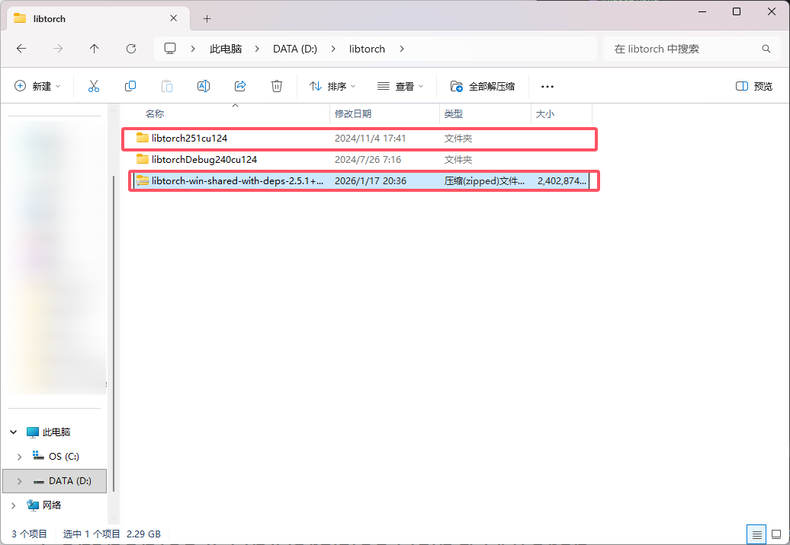

#### CMake

> 🕰**本地时间:** 2026年1月17日20:50:52

> ⚠️**注意:** 过高版本的 CMake (例如 CMake 4.2.1) 与 CMake < 3.5 的兼容性无法通过`cmake_minimum_required`的检查。

1. 在 [CMake 的历史版本页面](https://cmake.org/files/v3.30/) 中下载 `cmake-3.30.1-windows-x86_64.msi`。

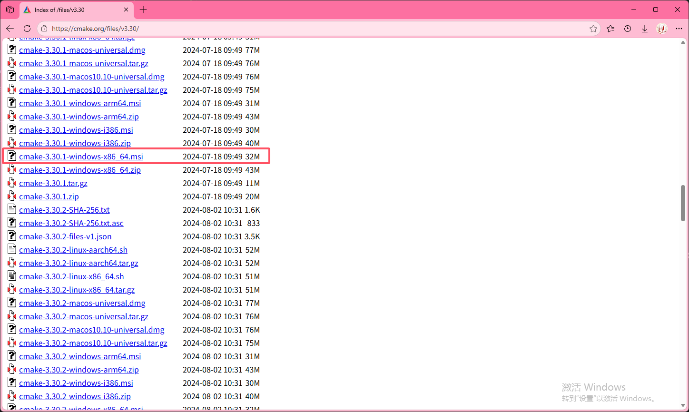

2. 双击下载得到的 `cmake-3.30.1-windows-x86_64.msi` 文件进行安装即可。

3. 确保系统环境变量中包含 CMake。

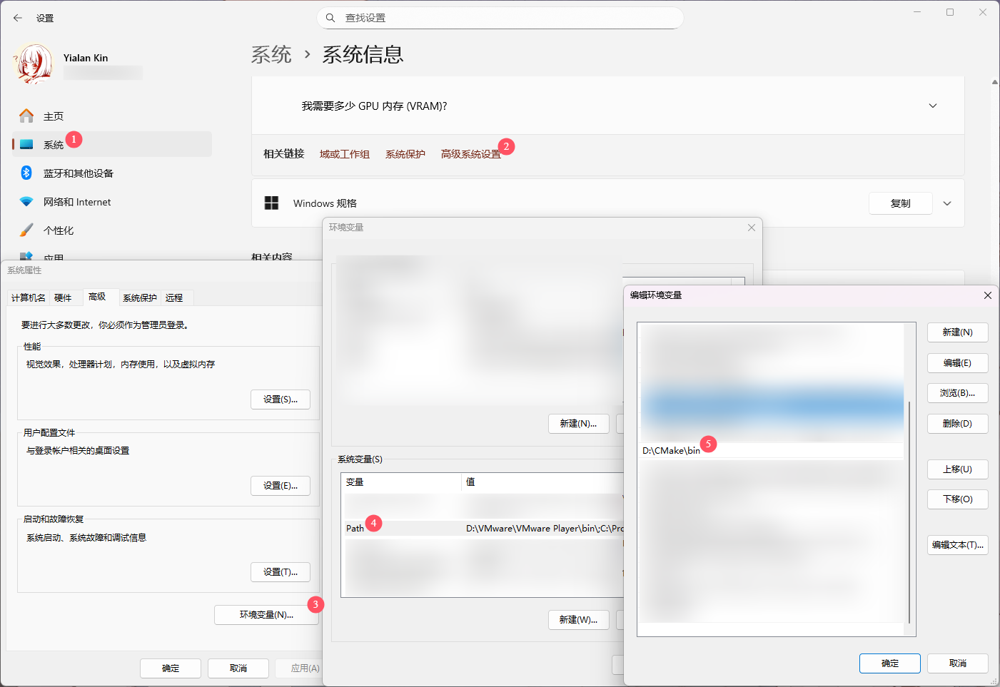

4. 在**命令提示符**中输入命令 `cmake --versoin` 以确认能识别到安装好的 CMake。

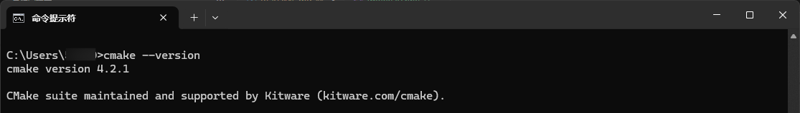

#### MATLAB

由于使用的开源数据集格式为 `.mat`，故本项目使用 MATLAB 做最基础的预处理 (仅划分为五折数据集用于训练与验证)。

MATLAB 属于商业软件，本文不提供下载与安装实践参考。需要注意的是，MATLAB 的较新版本有很大概率会在某些函数或操作上不兼容较旧版本，所以本文建议安装相同的 MATLAB R2018b 版本。

### 项目部署

#### 开源数据集的下载

本项目使用的开源数据集描述参考文献为 [A database of high-density surface electromyogram signals comprising 65 isometric hand gestures](https://www.nature.com/articles/s41597-021-00843-9#Sec8)，20 位受试者的数据文件可从 [figshare](https://springernature.figshare.com/collections/A_database_of_high-density_surface_electromyogram_signals_comprising_65_hand_gestures_performed_in_an_isometric_manner/5090861) 上下载。

> ⚠️**注意:** 总共 20 个文件，总大小为 131 GB，请确保磁盘空间充足。

#### 五折数据集的准备

> ⚠️**注意:** 接下来将直接使用到本项目的代码，请确保克隆本项目到本地。

1. 修改本项目路径下 `.\matlabScripts` 的 MATLAB 脚本文件 `generate_hdsEMG_windowed_samples.m` 中的变量:
- `raw_data_root_dir` 为下载的开源数据集的根目录，
- `output_root_dir` 为输出的五折数据集路径。

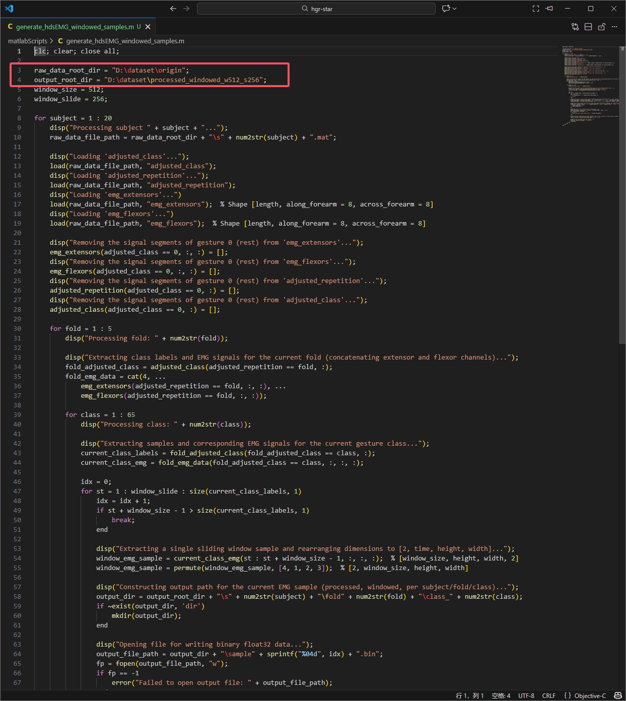

2. 使用 MATLAB 运行 `generate_hdsEMG_windowed_samples.m` 直到处理完所有数据即可。

#### HGR-STAR 的构建

1. 在本项目目录下打开命令提示符并输入 `mkdir build` 创建 `build` 文件夹。
2. 输入 `cd build` 切换当前目录到 `build` 文件夹。
3. 输入 `cmake -DCMAKE_PREFIX_PATH="D:\libtorch\libtorch251cu124" ..` 配置项目。

> ⚠️**注意:** 将其中的路径替换为你实际的 LibTorch 路径。

> ⚠️**注意:** 请确保能够连接到 GitHub 以下载依赖的 [nlohmann/json](https://github.com/nlohmann/json.git)。

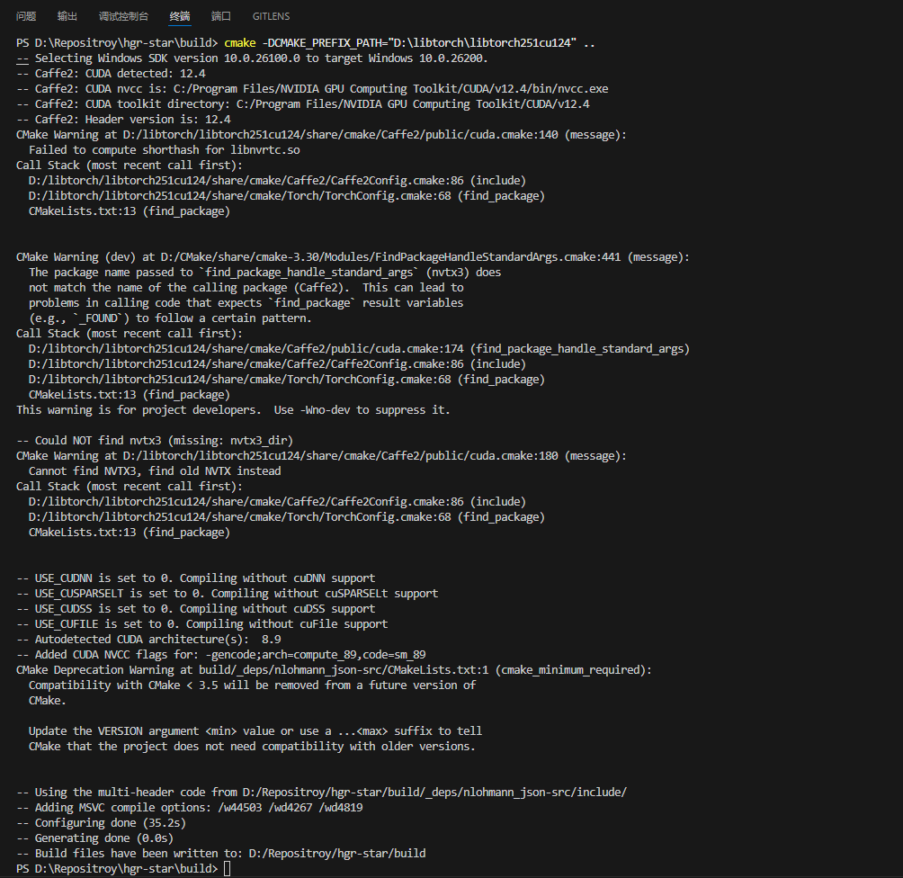

4. 输入 `cmake --build . --config release` 构建项目。

> ⚠️**注意:** 若选择的 LibTorch 为 Debug 版本，请使用 `cmake --build . --config debug` 进行构建。

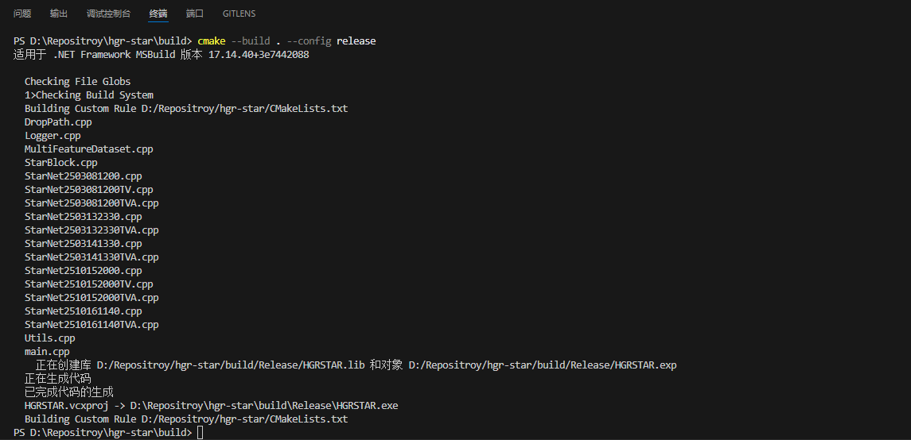

#### 训练与验证

1. 从 `.\Standby` 文件夹中选择所需的模型的所有或个别 `json` 文件，将其复制到 `.\json` 文件夹中。

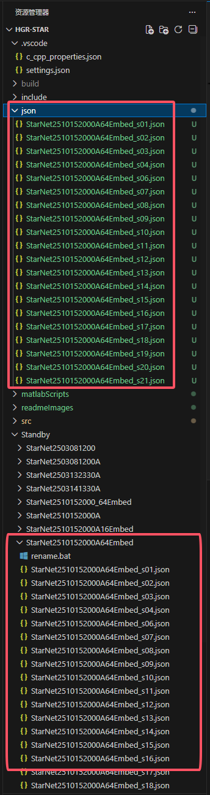

2. 修改每个 `json` 文件中的路径：
- `rootOrig` 为**五折数据集的准备**中的 `output_root_dir`
- `savePath` 为保存结果的路径，结果将包含最终 Epoch 的模型，准确率最优 Epoch 的模型，完整的训练验证日志。

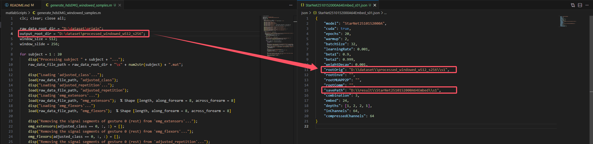

3. 在项目根目录 `.\` 打开**命令提示符**，输入 `.\run.bat` 开始训练与验证。

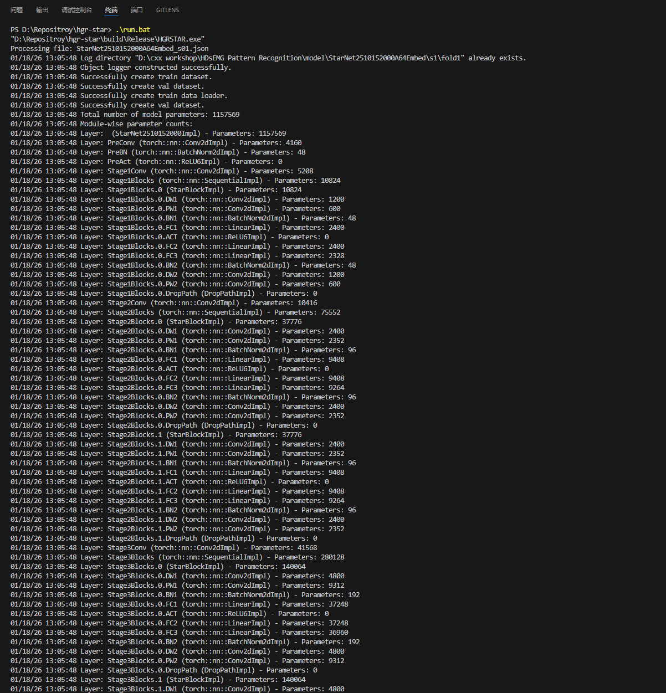

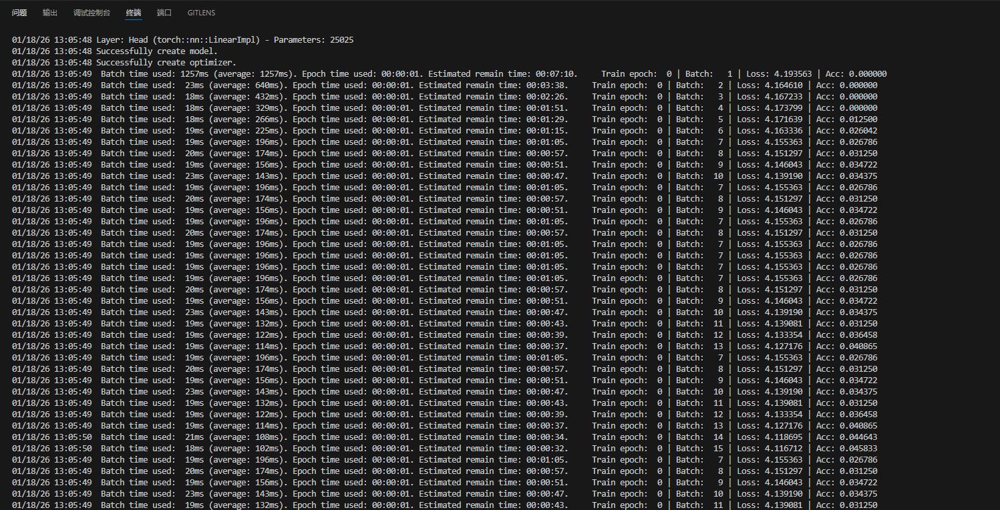

4. 在 `savePath` 目录下检视训练结果。

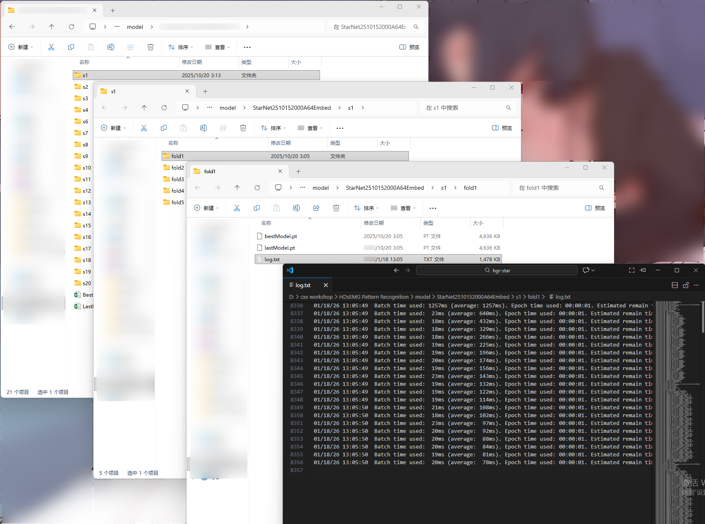
